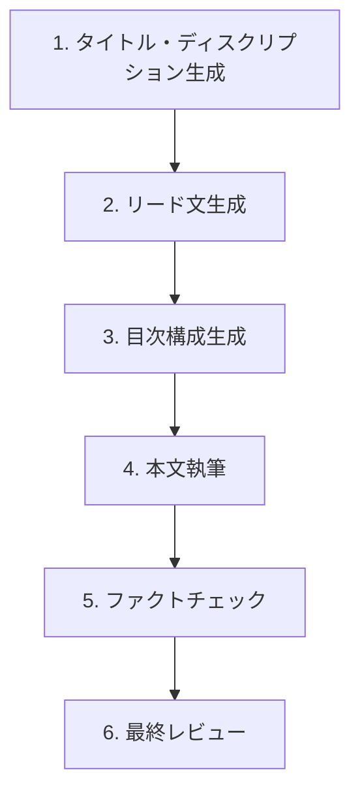
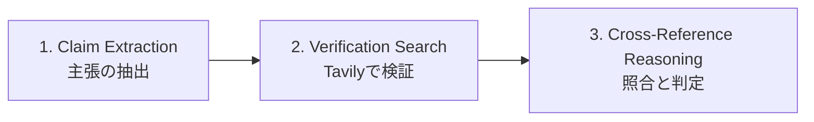

# Content Creation Skill

このスキルは、`neuronwriter_app` における高品質なコンテンツ制作の全工程を定義します。
エージェントはこのワークフローに従い、各フェーズのルールを厳守すること。

---

## 標準ワークフロー



| フェーズ | サブスキル | 必須入力 | 出力 |
|---------|-----------|---------|------|
| 1 | Title & Description | キーワード、SERP分析 | JSON: `{title, description}` |
| 2 | Lead Text | タイトル、ディスクリプション、SERP分析 | JSON: `{leadText}` |
| 3 | Outline | キーワード、競合分析、トレンド | JSON: `{headings[]}` |
| 4 | Body Writing | 目次構成、Web検索結果 | JSON: `{h2_intro, h3_contents[]}` |
| 5 | Fact Check | 生成された本文 | JSON: `{claims[], overallScore}` |

---

## サブスキル 1: タイトル・ディスクリプション生成

### 役割
検索結果で目を引き、クリック率を高めるタイトルとディスクリプションを生成する。

### 入力データ
- ターゲットキーワード
- SERP分析（検索意図、コンテンツタイプ）
- 推奨キーワード（使用率順）

### 出力フォーマット
```json
{
  "title": "30-60文字のタイトル",
  "description": "80-160文字のディスクリプション"
}
```

### ルール
1. **年号は必ず現在年を使用** - 過去の年号（currentYear-1等）は絶対に使用しない
2. タイトルに使用率の高い推奨キーワードを優先的に含める
3. 検索意図に合った表現を使用（情報提供型→「解説」「ガイド」、取引型→「おすすめ」「比較」）
4. 「【】」や「｜」で視認性を高める

### 禁止事項
- ❌ 過去の年号の使用
- ❌ SERPデータに含まれる古い情報の転用
- ❌ ターゲットキーワードの省略

---

## サブスキル 2: リード文生成

### 役割
読者の興味を引き、記事を読み進めたくなる導入文を生成する。

### 入力データ
- タイトル・ディスクリプション
- SERP分析（検索意図、コンテンツタイプ）
- 推奨キーワード

### 出力フォーマット
```json
{
  "leadText": "200-400文字のリード文"
}
```

### ルール
1. タイトル・ディスクリプションと重複しない内容
2. 読者の悩みへの共感 → 記事を読むメリット → 内容の予告
3. 検索意図に合わせた書き方

### 禁止事項
- ❌ タイトルの単純な言い換え
- ❌ 記事内容の詳細なネタバレ

---

## サブスキル 3: 目次構成生成

### 役割
SEOスコアを最大化する網羅的な目次構成を生成する。

### 入力データ
- ターゲットキーワード
- SERP分析・競合記事の見出し
- トレンド情報（Tavily検索結果）
- 現在のSEOスコアとターゲットスコア

### 出力フォーマット
```json
{
  "headings": [
    { "level": 2, "text": "見出しテキスト", "keywords": ["キーワード1"] },
    { "level": 3, "text": "小見出しテキスト", "keywords": ["キーワード2"] }
  ]
}
```

### ルール
1. **スコアギャップに基づくボリューム調整**
   - ギャップ40点以上: H2を8-12個、各H2にH3を2-5個
   - ギャップ20-40点: H2を6-8個、各H2にH3を2-4個
   - ギャップ20点未満: H2を4-6個、各H2にH3を1-3個
2. 競合が共通して持つ見出しは必ず網羅
3. 独自性のある見出しを最低1つ追加
4. トレンド情報を反映したH2またはH3を含める

### 禁止事項
- ❌ 競合の見出しの丸パクリ
- ❌ キーワードの不自然な詰め込み
- ❌ 論理的でない構成順序

---

## サブスキル 4: 本文執筆

### 役割
専門性が高く、読者に信頼される本文を執筆する。

### 入力データ
- H2見出しとH3構成
- Web検索結果（Tavily）
- 執筆モード（商用情報モード、辛口レビューモード）

### 出力フォーマット
```json
{
  "h2_intro": "H2直下の導入文（HTML形式）",
  "h3_contents": [
    { "heading": "H3見出し", "content": "本文（HTML形式）" }
  ]
}
```

### ルール
1. **PREP法**: 結論 → 理由 → 具体例 → まとめ
2. **年号の抑制**: 「currentYear年現在」は記事全体で1-2箇所に留める
3. `<strong>` で重要箇所を強調
4. `<ul><li>` で情報を構造化
5. **商用情報モードON時**: 「【currentYear年currentMonth月現在】」でキャンペーン情報を強調
6. **辛口レビューモードON時**: デメリットや注意点を積極的に記載
7. **まとめ系H2**: 導入文ではなく記事全体の総括として執筆

### 禁止事項
- ❌ 検索結果に含まれない情報の創作（ハルシネーション）
- ❌ 年号の過剰な繰り返し
- ❌ 提灯記事的な一方的な礼賛

---

## サブスキル 5: ファクトチェック

### 役割
生成された本文の事実確認を行い、ハルシネーションを検出・修正する。

### 3ステップ検証ワークフロー（ベストプラクティス）



#### Step 1: Claim Extraction（主張の抽出）
元の文章から「2025年12月のドル円相場は〜」「この機能の料金は〜」といった、事実確認が必要な「主張（Claim）」を箇条書きで抽出する。

#### Step 2: Verification Search（Tavilyでの検証）
抽出した各主張に対して、Tavilyで検索を実行する。

#### Step 3: Cross-Reference Reasoning（照合と判定）
推論モデル（DeepSeek-R1、OpenAI o3-mini等）に以下を渡してジャッジさせる：
- 元の文章
- Tavilyの検索結果
- 「検索結果と矛盾する箇所をすべて指摘し、根拠を述べてください」というプロンプト

---

### Tavily API 推奨設定（精度最大化）

ファクトチェック時は以下のパラメータを**必須**で使用すること：

```typescript
// server/_core/tavily.ts - ファクトチェック専用設定
const factCheckOptions = {
  search_depth: "advanced",      // 深いWeb探索（必須）
  include_answer: true,          // Tavily側でAI回答を生成（比較用）
  include_raw_content: true,     // 全文取得（細かい数値確認用）
  topic: "news",                 // 最新情報優先（時事トピック時）
  max_results: 5,                // 十分なソース数
};
```

| パラメータ | 値 | 効果 |
|-----------|-----|------|
| `search_depth` | `"advanced"` | 通常より深くWebを探索。複数ソース突き合わせに必須 |
| `include_answer` | `true` | Tavily側でソース統合回答を生成。LLM出力との差異検出に有効 |
| `include_raw_content` | `true` | Webサイト全文取得。要約で見落とされる数値・条件を確認 |
| `topic` | `"news"` | 時事情報（FX、IT最新情報等）の古い情報によるハルシネーション防止 |

> ⚠️ **注意**: `search_depth="advanced"` は1件あたりのAPIコストが上がるが、ファクトチェックでは精度が最優先。

---

### 出力フォーマット
```json
{
  "overallScore": 85,
  "claims": [
    {
      "claim": "主張テキスト",
      "status": "verified | contradicted | unverified",
      "reasoning": "判定理由（検索結果IDを引用）",
      "sources": [{ "title": "出典タイトル", "url": "URL" }],
      "tavilyAnswer": "Tavily生成回答（比較用）"
    }
  ],
  "summary": "検証結果の要約"
}
```

### ルール
1. **検索結果のみを根拠とする** - 自身の知識は使用しない
2. 判定は3種類: verified（確認）、contradicted（矛盾）、unverified（未確認）
3. 矛盾があれば具体的な修正案を提示
4. **Tavilyの`answer`とLLM出力を比較**し、食い違いを即座に検出
5. **推論モデルを使用**（`ENV.hallucinationLlmModel`で設定）

### 禁止事項
- ❌ `search_depth="basic"` でのファクトチェック実行
- ❌ 検索結果なしでの判定
- ❌ 主観的な意見の事実としての扱い
- ❌ 古い情報での検証（`topic="news"` 設定忘れ）

---

### スコアリング計算式

```
score = 100 - (contradicted / total × 100) - (unverified / total × 20)
```

- **contradicted（矛盾）**: 1件あたり `100/total` 点減点
- **unverified（未確認）**: 1件あたり `20/total` 点減点（軽微ペナルティ）

---

### 将来対応予定：外部ツール連携

| ツール | 用途 |
|-------|------|
| **DeepEval** | 「Hallucination Metric」でContext対回答の一致度を0〜1で数値化 |
| **Langfuse** | API実行ログ記録、人間フィードバック、AI自動評価 |

---

## 聖域（絶対に変更禁止）

以下はコンテンツ生成の**核心ロジック**であり、エージェントが勝手に変更してはならない。

| ファイル | 関数/プロンプト | 禁止事項 |
|---------|---------------|---------|
| `server/routers.ts` | `generateTitleAndDescription` | 年号ルールの削除、出力形式の変更 |
| `server/routers.ts` | `generateLeadText` | 文字数制限の変更 |
| `server/routers.ts` | `generateOutline` | スコアギャップ計算ロジックの変更 |
| `server/routers.ts` | `writeChapterWithSearch` | PREP法の削除、モード設定の無効化 |
| `server/factcheck.ts` | `checkTextFactuality` | 検証ステータスの定義変更 |

### 変更が必要な場合
1. 必ずユーザーに確認を取る
2. 変更理由と影響範囲を明記する
3. 既存の出力フォーマットとの互換性を維持する

---

## 品質チェックリスト

各フェーズ完了時に確認：

- [ ] 出力がJSON形式で正しくパースできる
- [ ] 年号が現在年のみ使用されている
- [ ] 推奨キーワードが自然に含まれている
- [ ] 検索意図に合った表現が使われている
- [ ] ハルシネーション（事実と異なる記述）がない

---

## 環境変数リファレンス

コンテンツ生成に関連する環境変数は `server/_core/env.ts` で一元管理される。

### 必須環境変数

| 環境変数名 | ENV参照名 | 用途 |
|-----------|----------|------|
| `BUILT_IN_FORGE_API_KEY` | `ENV.forgeApiKey` | LLM API認証キー（OpenRouter） |
| `TAVILY_API_KEY` | `ENV.tavilyApiKey` | Tavily Web検索API認証 |
| `DATABASE_URL` | `ENV.databaseUrl` | データベース接続URL（Railway MySQL） |
| `X_API_KEY` | - | NeuronWriter API認証キー |

### LLM設定

| 環境変数名 | ENV参照名 | 用途 | 現在の設定 |
|-----------|----------|------|-----------|
| `BUILT_IN_FORGE_API_URL` | `ENV.forgeApiUrl` | LLM APIエンドポイント | `https://openrouter.ai/api/v1/chat/completions` |
| `LLM_MODEL` | `ENV.llmModel` | 通常コンテンツ生成用モデル | `x-ai/grok-4-fast` |

### ファクトチェック専用設定

| 環境変数名 | ENV参照名 | 用途 | 現在の設定 |
|-----------|----------|------|-----------|
| `HALLUCINATION_LLM_API_KEY` | `ENV.hallucinationLlmApiKey` | ファクトチェック専用APIキー | 別キー設定済み |
| `HALLUCINATION_LLM_MODEL` | `ENV.hallucinationLlmModel` | ファクトチェック専用モデル | `deepseek/deepseek-r1` |

> 💡 **設計意図**: ファクトチェックには推論特化モデル（DeepSeek-R1）を使用し、通常のコンテンツ生成（Grok-4）と分離することで、精度とコストを最適化。

### 認証・セキュリティ

| 環境変数名 | ENV参照名 | 用途 |
|-----------|----------|------|
| `JWT_SECRET` | `ENV.cookieSecret` | セッション認証用シークレット |
| `VITE_APP_ID` | `ENV.appId` | アプリケーション識別子 |
| `OAUTH_SERVER_URL` | `ENV.oAuthServerUrl` | OAuth認証サーバーURL |

### 環境変数の使用ルール

1. **コード内で直接 `process.env` を使用しない** - 必ず `ENV` オブジェクト経由
2. **新しい環境変数を追加する場合**は `server/_core/env.ts` に定義を追加
3. **機密情報（APIキー等）はログ出力しない**

```typescript
// ✅ 正しいパターン
import { ENV } from "./_core/env";
const apiKey = ENV.tavilyApiKey;

// ❌ 禁止パターン
const apiKey = process.env.TAVILY_API_KEY;  // 直接参照禁止
console.log(`API Key: ${ENV.forgeApiKey}`); // ログ出力禁止
```

---

## 変更履歴

| 日付 | 変更内容 |
|------|---------|
| 2026-01-17 | 環境変数リファレンス追加、ファクトチェック高度設定追加 |
| 2026-01-16 | 初版作成 |
