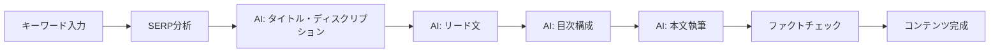
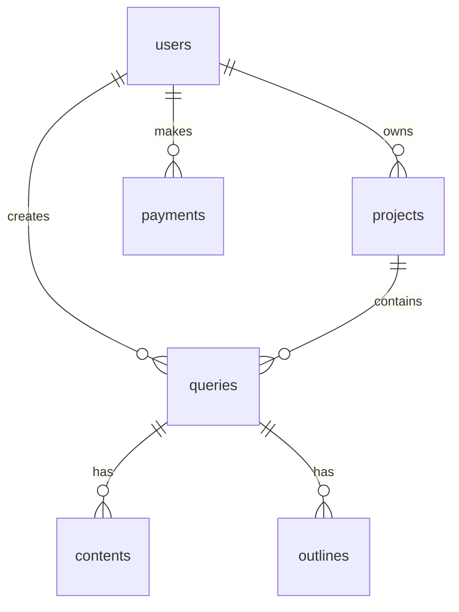

# NeuronWriter_APP 詳細解説

このドキュメントは、`neuronwriter_app` の全体構造と機能を詳細に解説します。

---

## アプリケーション概要

**NeuronWriter_APP** は、SEO最適化された記事を効率的に作成するための統合プラットフォームです。



---

## 技術スタック

| カテゴリ | 技術 |
|---------|------|
| **フロントエンド** | React 19, Wouter, TanStack Query |
| **バックエンド** | Express + tRPC |
| **ORM** | Drizzle ORM |
| **データベース** | MySQL (Railway) |
| **スタイリング** | Tailwind CSS 4, shadcn/ui |
| **ビルド** | Vite |
| **言語** | TypeScript |

---

## ディレクトリ構造

```
neuronwriter_app/
├── client/src/           # フロントエンド
│   ├── pages/            # 12ページ
│   ├── components/       # 60コンポーネント
│   └── _core/hooks/      # カスタムフック
├── server/               # バックエンド
│   ├── routers.ts        # tRPC APIエンドポイント (79KB)
│   ├── db.ts             # DB操作関数
│   ├── factcheck.ts      # ファクトチェック
│   └── _core/            # 認証・ユーティリティ
├── drizzle/              # DBスキーマ・マイグレーション
└── .agent/skills/        # AIエージェント用スキル
```

---

## データベーススキーマ（6テーブル）

| テーブル | 主な用途 |
|---------|---------|
| `users` | ユーザー管理、認証、クレジット残高 |
| `projects` | NeuronWriterプロジェクト参照 |
| `queries` | 検索クエリ（キーワード）とメタデータ |
| `contents` | 記事コンテンツとリビジョン |
| `outlines` | AI生成目次構造（JSON形式） |
| `payments` | Stripe決済履歴 |
| `api_usage` | NeuronWriter API月間使用量（200枠/月） |

### ER図



---

## ページ構成（12ページ）

| ページ | パス | 説明 |
|-------|-----|------|
| `Home.tsx` | `/` | ランディングページ |
| `Login.tsx` | `/login` | ログイン・ユーザー登録 |
| `Dashboard.tsx` | `/dashboard` | ユーザーダッシュボード |
| `NewQuery.tsx` | `/new-query` | 新規キーワード作成 |
| `QueriesList.tsx` | `/queries` | クエリ一覧 |
| `QueryDetail.tsx` | `/query/:id` | **メイン編集画面**（詳細分析・AI執筆・編集） |
| `AdminDashboard.tsx` | `/admin` | 管理者ダッシュボード |
| `AdminNewQuery.tsx` | `/admin/new-query` | 管理者用キーワード作成 |
| `AdminQueriesList.tsx` | `/admin/queries` | 管理者用クエリ一覧 |
| `BillingPage.tsx` | `/billing` | クレジット購入 |
| `BillingSuccessPage.tsx` | `/billing/success` | 決済完了 |
| `NotFound.tsx` | `*` | 404ページ |

---

## 外部API連携

### 1. NeuronWriter API
- **用途**: SERP分析、推奨キーワード取得、SEOスコア評価
- **認証**: `X-API-KEY` ヘッダー

| エンドポイント | 用途 |
|---------------|------|
| `/new-query` | 新規クエリ作成 |
| `/get-query` | 推奨データ取得 |
| `/evaluate-content` | SEOスコア評価 |

### 2. Tavily API
- **用途**: Web検索（本文執筆時）、ファクトチェック
- **モード**: `search_depth: "advanced"` でファクトチェック精度最大化

### 3. OpenRouter (LLM)
- **通常モデル**: `x-ai/grok-4-fast` - タイトル・本文生成
- **推論モデル**: `deepseek/deepseek-r1` - ファクトチェック

---

## コンテンツ生成ワークフロー（5フェーズ）

### Phase 1: タイトル・ディスクリプション
- 30-60文字のタイトル、80-160文字のディスクリプション
- 年号は現在年のみ使用

### Phase 2: リード文
- 200-400文字の導入文
- 読者の悩み→メリット→内容予告

### Phase 3: 目次構成
- スコアギャップに応じたH2/H3ボリューム調整
- 競合分析＋トレンド反映

### Phase 4: 本文執筆
- PREP法（結論→理由→具体例→まとめ）
- Web検索結果を根拠として使用

### Phase 5: ファクトチェック
- 3ステップ検証（主張抽出→Tavily検索→照合判定）
- スコアリング: 矛盾で大減点、未確認で軽微減点

---

## RBAC（役割ベースアクセス制御）

| 役割 | アクセス可能機能 |
|-----|----------------|
| **admin** | NeuronWriter APIデータ閲覧、ユーザー管理、API使用量確認 |
| **user** | 記事作成（AI成果物のみ表示）、クレジット購入 |

> ⚠️ **重要**: 一般ユーザーには推奨語句リスト・SERP生データは表示しない（ライセンス制限）

---

## 課金システム（Stripe連携）

| 項目 | 価格 |
|-----|------|
| 1クレジット | 1,000円 |
| 1キーワード分析 | 1クレジット消費 |

### フロー
```
クレジット残高チェック → API枠チェック → NeuronWriter呼び出し → 成功時: credits -= 1
```

---

## 主要コンポーネント

| コンポーネント | 役割 |
|--------------|------|
| `OutlineEditor` | 目次編集・ドラッグ＆ドロップ・本文生成 |
| `SEOScoreBar` | SEOスコア表示 |
| `CreditComponents` | クレジット残高表示・購入ボタン |

---

## 環境変数

```env
# DB
DATABASE_URL=mysql://...

# 認証
JWT_SECRET=...

# NeuronWriter
X_API_KEY=n-...

# Tavily
TAVILY_API_KEY=tvly-...

# LLM (OpenRouter)
BUILT_IN_FORGE_API_KEY=sk-or-v1-...
LLM_MODEL=x-ai/grok-4-fast

# ファクトチェック
HALLUCINATION_LLM_MODEL=deepseek/deepseek-r1

# Stripe
STRIPE_SECRET_KEY=sk_live_...
```

---

## スキルドキュメント

| ファイル | 内容 |
|---------|------|
| `app_rebuild.md` | 再構築用完全ガイド |
| `content_creation.md` | コンテンツ生成ルール・プロンプト |
| `api_connection.md` | API接続設定 |
| `json_data_structures.md` | **JSONデータ構造定義（更新済み）** |

---

## UI改善・機能強化履歴 (2026-01-17)

### QueryDetailページ（詳細分析・編集画面）

#### 1. SERP分析 UI
- **視覚化**: 検索意図とコンテンツタイプの割合をプログレスバーで可視化
- **日本語化**: 英語の識別子（`informational`, `listicle` 等）を全て日本語に置換
- **デザイン**: アイコンとカラーコーディングによる直感的な表示

#### 2. 競合分析 UI
- **全件表示**: 上位30件の競合全てのデータを表示可能に（以前は一部のみ）
- **アコーディオン展開**: 上位3件をデフォルト展開、以降は折りたたみ表示
- **UI整理**: 指標セクションとの重複を避けるため、サマリーカードを削除

#### 3. 指標（Metrics）セクション
- **データ適正化**: APIの正しいフィールド（`target`/`median`）を参照
- **自動計算**: 競合データから平均スコア・読みやすさを動的に計算・表示
- **カードデザイン**: アイコン付きのモダンなカードデザインへ刷新

#### 4. キーワード分析 UI
- **ヒートマップ風表示**: 使用率に応じて3段階（緑・青・黄）に色分け
- **ソート機能**: 重要度（使用率）順に自動ソート
- **アイコン分類**: タイトル（👑）、H1（🥇）などで視覚的にカテゴリを区別
- **推奨数表示**: ツールチップおよびタグで推奨使用回数を表示

#### 5. インフラ・データ
- **スキルファイル拡充**: `sample1.json`～`sample3.json`を追加し、多様なキーワードパターン（画像生成、Python、ChatGPT料金等）を解析
- **構造定義更新**: `json_data_structures.md` に最新のコンテンツタイプ定義（`listicle`, `landing-page`等）を追加
